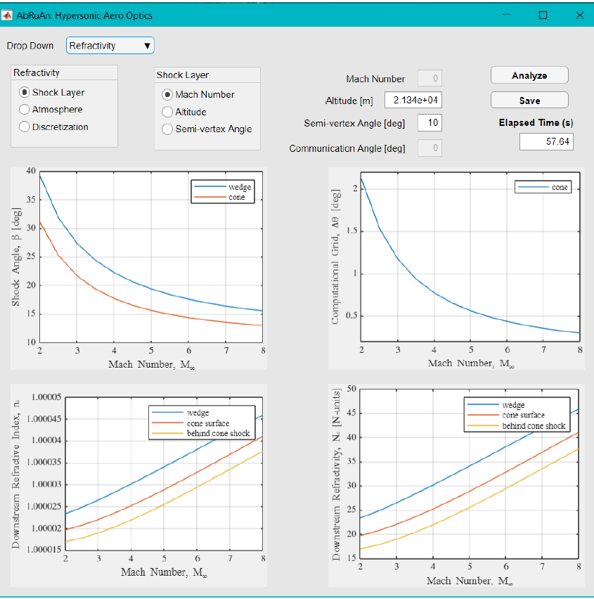

.. _aboutAbruan:

AbRuAn: Planetary and Plasma Optics Simulation Framework
========================================================

AbRuAn (or abruan) is named after - Abhinav Gupta, Ruchi Gupta, and Anil Kumar Gupta.
It is an aero-optical simulation framework for the analysis of aero-optics in high-speed flows.
The framework was first developed at the University of Colorado Boulder as a part of graduate thesis work of
Anubhav Gupta with guidance of `Dr. Brian Argrow <https://www.colorado.edu/aerospace/brian-argrow>`__.
The current version is re-architected and extended in collaboration with 
`Dr. Nicholas Campbell <https://www.colorado.edu/lab/ngpdl/nicholas-s-campbell>`__.
The package is restricted from wide public distribution but may be requested by an individual or group or organization.

Architecture
-------------

.. sidebar:: AbRuAn Vision

   .. image:: _static/abruan-logo.svg
       :align: center
       :width: 300

   **Description:** A simulation framework for aero, gas, and plasma optics analysis in high-speed and planetary environment. 
   
   **License:** MIT License (Not Finalized)

   **Platforms:** macOS, Linux and Windows
   
   **First Release:** Jun 2020

   **Planned Release:** Q3 2026

   **Status:** In development

AbRuAn is aimed at faster execution, flexibility of reconfiguration, multi-species modeling in planetary atmospheres, and Monte Carlo analysis.
The revised architecture and documentation style is heavily inspired by `Basilisk: an Astrodynamics Simulation Framework
<http://hanspeterschaub.info/basilisk/index.html>`__.
Frames and domains form the basis of this framework.
Flowfield, if computed using external solver, can be read and used for aero-optics.

**First Architecture:** Abruan was first developed in MATLAB with GUI created using the App Designer. It was packaged as a standalone application which required downloading MATLAB Runtime (MCR) at the first instance of use if MATLAB is not installed on the host computer. The first release was in 2020. 

Graphical user Interface of AbRuAn from 2020 version.

What is AbRuAn used for?
--------------------------
This framework is capable of optical propagation analysis in:

- planetary environments
- hypersonic and re-entry flows
- communication with and from stationary/moving objects
- laser ranging such as for LiDAR

AbRuAn Design Goals
--------------------
The design inherits several goals from Basilisk with major difference lying in optical dynamics propagation
and tasks handling pertainting to wave packets as opposed to flight software in Basilisk.

- Scalibility
- Scriptability
- Analysis
- Monte Carlo

.. ---------------------

.. role:: me
.. role:: venue
.. role:: note

Relevant Publications
----------------------
Thesis:
~~~~~~~
.. rst-class:: publist

- Gupta, A.; "`Analytical Theory of Aero-Optical and Atmospheric Effects in Supersonic and Hypersonic Flows. <https://scholar.colorado.edu/concern/graduate_thesis_or_dissertations/mg74qn20w>`_” :venue:`Master’s thesis`, the University of Colorado at Boulder, 2020.

Papers:
~~~~~~~

.. rst-class:: publist

#. Gupta, A.; and Argrow, B.; "`Analytical Approach for Aero-Optical and Atmospheric Effects in Supersonic Flow Fields. <https://arc.aiaa.org/doi/10.2514/6.2020-0684>`__" In: :venue:`AIAA SciTech`, Orlando, FL, Jan. 6 - 10, 2020.
#. Gupta, A.; Ripoll, P. M.; Campbell, N. S.;  and Argrow, B.; "`Assessment of Optical Propagation Models with Application to Hypersonic Entry. <https://arc.aiaa.org/doi/10.2514/6.2023-0817>`__" In: :venue:`AIAA SciTech`, National Harbor, MD, Jan. 23 - 28, 2023.
#. Gupta, A.; "`Basilisk and Docker for Streamlined GN&C Simulation. <https://zenodo.org/records/15008785>`__" In: :venue:`46th Annual AAS GN&C Conference`, Breckenridge, CO, Feb. 2 - 7, 2024.

.. toctree::
   :hidden:
   :maxdepth: 2
   :caption: AbRuAn:

   rst/install
   rst/examples

.. Indices and tables
.. ==================

.. * :ref:`genindex`
.. * :ref:`modindex`
.. * :ref:`search`